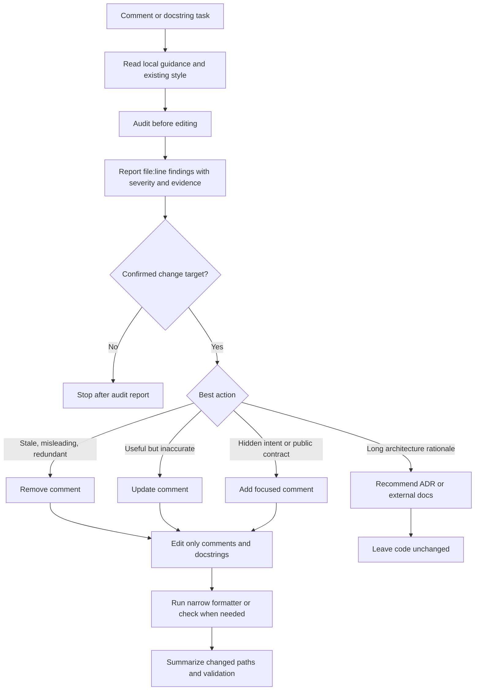

# improve-code-comments

Codex skill for auditing and improving code comments without creating comment noise or changing executable code.

The installable skill lives at `improve-code-comments/SKILL.md`.

## Workflow



## Install

One-line install:

```bash
curl -fsSL https://raw.githubusercontent.com/wufei-png/improve-code-comments/main/install.sh | bash
```

This installs the skill into `${CODEX_HOME:-$HOME/.codex}/skills/improve-code-comments`.

To install elsewhere:

```bash
curl -fsSL https://raw.githubusercontent.com/wufei-png/improve-code-comments/main/install.sh \
  | IMPROVE_CODE_COMMENTS_SKILL_DIR=/path/to/skills/improve-code-comments bash
```

## Reference Projects

This skill is a small synthesis of several existing agent skills and real-project documentation conventions. It intentionally borrows principles, not large frameworks.

| Project | Original URL | What was useful | How it was folded in |
|---|---|---|---|
| `petekp/claude-code-setup@code-comments` | https://www.skills.sh/petekp/claude-code-setup/code-comments | Plain-language comments, co-located context, and the "why not what" test | Became the core writing rule, but the original "every file should have a header" idea was narrowed to "only when the file role is non-obvious" |
| `levnikolaevich/claude-code-skills@ln-613-code-comments-auditor` | https://www.skills.sh/levnikolaevich/claude-code-skills/ln-613-code-comments-auditor | Audit-first workflow, file:line evidence, severity, stale comments, and commented-out code detection | Became the default report-first workflow, without adopting the heavy pipeline or density scoring |
| `ertugrul-dmr/clean-code-skills@clean-comments` | https://www.skills.sh/ertugrul-dmr/clean-code-skills/clean-comments | Remove metadata comments, obsolete comments, redundant comments, and commented-out code | Became the removal-first cleanup rule |
| `gohypergiant/agent-skills@accelint-ts-documentation` | https://www.skills.sh/gohypergiant/agent-skills/accelint-ts-documentation | Public API documentation needs more detail than internal code; tool directives must be preserved | Became the public-vs-internal tiering rule and the directive-preservation rule |
| `paulkinlan/co-do@comment-analyzer` | https://www.skills.sh/paulkinlan/co-do/comment-analyzer | Verify comment accuracy, comment rot, numeric thresholds, fallback behavior, and references | Became the accuracy-check section |
| `cxuu/golang-skills@go-documentation` | https://www.skills.sh/cxuu/golang-skills/go-documentation | Exported symbols deserve documentation; unexported/trivial code should not be documented mechanically | Reinforced the public API boundary without importing Go-specific style |
| `third774/dotfiles@documenting-code-comments` | https://www.skills.sh/third774/dotfiles/documenting-code-comments | Preserve institutional knowledge during refactors | Became the preserve-before-delete rule |
| `aj-geddes/useful-ai-prompts@code-documentation` | https://www.skills.sh/aj-geddes/useful-ai-prompts/code-documentation | Comprehensive API/docstring templates | Used as a counterexample: useful for public libraries, too likely to over-document ordinary app code |
| `pipecat-ai/pipecat@docstring` | https://www.skills.sh/pipecat-ai/pipecat/docstring | Follow the project's existing docstring convention | Became "match existing project style" rather than forcing one format |
| PyTorch `.claude/skills/docstring` | https://github.com/pytorch/pytorch/blob/main/.claude/skills/docstring/SKILL.md | Large-project evidence that local docstring style matters more than generic templates | Reinforced style detection before edits |
| `mattpocock/skills@grill-me` and `grill-with-docs` | https://www.skills.sh/mattpocock/skills/grill-me and https://www.skills.sh/mattpocock/skills/grill-with-docs | Ask, inspect, and use project docs/glossary before changing things | Reinforced audit and local-guidance lookup before edits |
| Vercel AI ADR skill | https://github.com/vercel/ai/blob/main/skills/adr-skill/SKILL.md | Long design rationale belongs in ADRs/docs, not giant inline comments | Became the escalation rule for architecture explanations |

The result is deliberately smaller than most sources: one installable `SKILL.md`, no scripts, no reference files, no automatic whole-repo rewrite behavior.

Final shape:

- audit first, edit second;
- explain why, not what;
- remove stale, misleading, redundant, and commented-out comments;
- match the repo's existing documentation style;
- document public APIs more fully than internal code;
- preserve institutional knowledge during refactors;
- recommend ADRs or docs for long design rationale instead of oversized inline comments.

## Layout

- `improve-code-comments/` is the installable skill folder.
- `install.sh` installs only the skill files into Codex's skill directory.
- `tests/` verifies the installer behavior.
- `docs/research-summary.md` records the research synthesis.
- `work/` is local research scratch space and is intentionally ignored.

## Verify

```bash
PYTHONDONTWRITEBYTECODE=1 python -m unittest tests.test_install_script -v
python /Users/wufei2/.codex/skills/.system/skill-creator/scripts/quick_validate.py improve-code-comments
```
